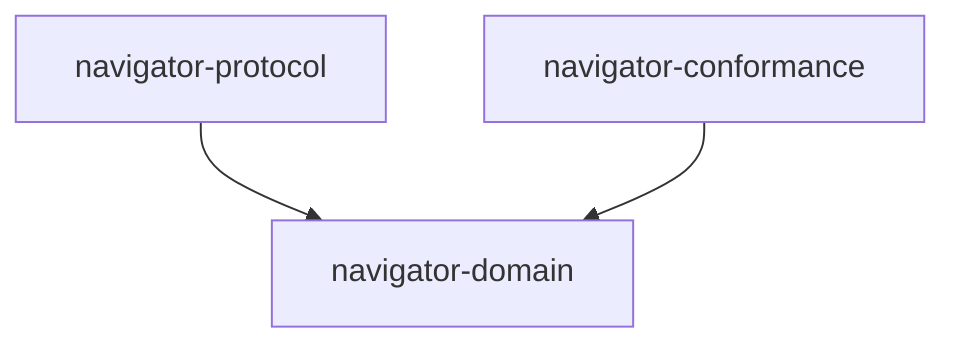

# Navigator

Navigator is a durable coordination kernel for long-running work. Its core is
independent of operating systems, transports, orchestration products, and
driver implementations. Pi is the first driver, not part of the core model.

The normative project vision lives in [`docs/`](docs/). Implementation plans
live in [`plans/`](plans/) and may be replaced as the implementation evolves.

## Workspace boundaries



Dependencies may only point downward as shown. Drivers, stores, SDKs, and the
runtime kernel are introduced by their owning vertical slices; Foundation does
not create placeholder crates for them.

## Prerequisites

Install [mise](https://mise.jdx.dev/) and activate the pinned toolchain:

```sh
mise install
mise exec -- cargo install cargo-deny --version 0.20.2 --locked
mise exec -- cargo install cargo-machete --version 0.9.2 --locked
mise exec -- cargo install cargo-llvm-cov --version 0.9.0 --locked
mise exec -- rustup component add llvm-tools-preview
```

## Verification

Run the complete Foundation gate:

```sh
./scripts/check.sh
```

The command runs formatting, linting, semantic tests, an offline build,
dependency-direction checks, supply-chain policy, and unused-dependency checks.
It writes the full execution log, per-gate logs, and deterministic
machine/human transcript summaries to `target/conformance/`.

Coverage is diagnostic evidence, not a substitute for semantic tests:

```sh
./scripts/coverage.sh
```

Reports are written to `target/coverage/`. To update dependencies while proving
that committed protocol fixtures did not drift:

```sh
./scripts/update-dependencies.sh
```
